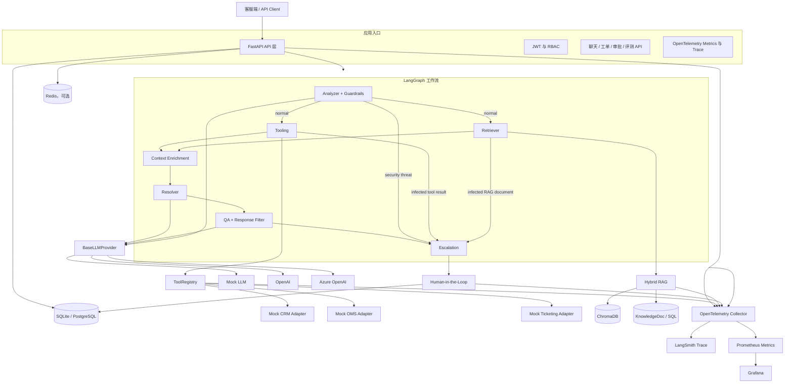
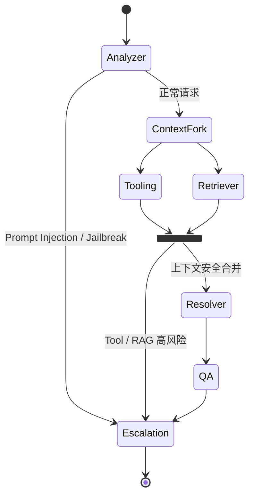
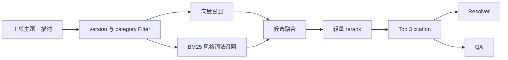
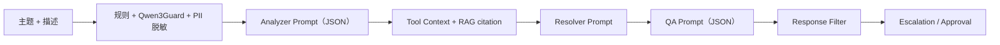
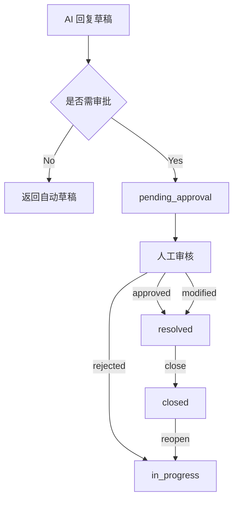
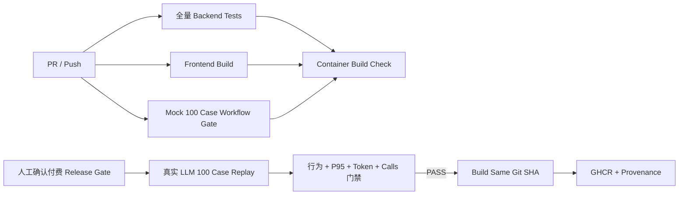

# SupportGPT Enterprise 技术架构设计

> 本文从工程实现角度说明当前系统的技术架构。它描述的是已落地的实现与明确未采用的方案，不将规划能力写成现状。项目整体背景、Mock 边界和业务流程以 `00_PROJECT_CONTEXT.md` 为准。

## 1. 架构目标与原则

系统面向售后客服工单场景，核心目标不是构建一个任意自治的通用 Agent，而是在高风险业务中提供可控、可审计、可降级的客服处理流水线。

架构遵循以下原则：

- **先安全、后生成**：Prompt Injection、Jailbreak 和 PII 处理发生在业务工具调用与 LLM 生成之前。
- **显式编排、职责单一**：将理解、工具补全、检索、生成、质量校验和升级决策拆成明确节点。
- **上下文有据可查**：回复同时使用 RAG citation 和结构化业务上下文，API 返回检索与工具审计信息。
- **高风险操作受治理**：工具统一经过 ToolRegistry，工单状态统一经过状态机，高风险回复进入 Human-in-the-Loop。
- **本地可复现、生产可替换**：Mock LLM、SQLite、可选 Redis 和本地 ChromaDB 使 Demo 可离线运行；Provider、Adapter 和部署配置保留替换空间。
- **避免虚构能力**：当前没有 MCP、动态 Planner、TaskState、Checkpoint、分布式任务队列或持久化 Agent 执行状态。

## 2. 整体架构图

### 架构层职责

| 架构层 | 职责 | 输入 | 输出 | 采用原因 | 可替代方案与权衡 |
|---|---|---|---|---|---|
| API 层 | 接收请求、鉴权、编排持久化、返回可审计结果 | HTTP 请求、JWT、会话与工单参数 | API 响应、工单与审批记录 | FastAPI 适合异步 I/O 和 Schema 驱动接口 | Django / Flask；前者更重，后者需自行补齐异步与校验能力 |
| Agent 层 | 执行客服理解、检索、生成和风控流程 | 当前工单与知识库版本 | 回复草稿、citation、工具审计、升级结论 | LangGraph 适合显式状态机式 Agent 编排 | 普通 Chain 难以表达条件路由与节点观测；工作流引擎会增加结构复杂度 |
| 工具层 | 获取结构化业务上下文并进行调用治理 | 客户标识、操作角色、工单标识 | 工具结果和审计信息 | ToolRegistry 统一权限、Schema、超时和 Mock 标记 | 直接调用 Adapter 简单但不可审计；Function Calling / MCP 尚未采用 |
| 知识层 | 管理知识文档、版本、检索与 citation | 查询、版本、类别 | Top-K citation | Hybrid RAG 兼顾语义与精确词匹配 | 纯向量检索较简单但对规则编号、时间窗口和产品词不稳定 |
| 数据层 | 保存用户、工单、会话、文档和审批数据 | 领域实体 | 事务性持久化记录 | SQLAlchemy Async 同时兼容 SQLite 与 PostgreSQL | 纯 NoSQL 模式更灵活但不利于工单状态和审批事务约束 |
| 可观测层 | 统一采集全局指标和单次调用路径 | 请求、节点、工具、检索、审批事件 | OTel Trace / Metrics，经 Collector 转发 LangSmith 与 Prometheus | Metrics 看趋势、Trace 定位单次慢点 | Collector 增加一层运维成本，但消除了应用双轨采集 |

## 3. LangGraph Workflow

### 3.1 工作流图

### 3.2 节点编排

| 节点 | 职责 | 输入 | 输出 | 设计原因 | 可替代方案 | 当前取舍 |
|---|---|---|---|---|---|---|
| Analyzer | 规则与 Qwen3Guard 语义安全检测、PII 脱敏、情绪/优先级/部门/意图分类和初始风险评估 | 主题、描述 | 分类结果、置信度、脱敏文本、语义安全结果或安全阻断 | 在早期阻断风险，减少越权工具和无效 LLM 调用 | 只用规则、只用专用分类模型 | 固定高置信度意图优先规则分类，模糊/多意图才调用精简 LLM Schema |
| Context Enrichment | 并行执行 Tooling 与 Retriever，以风险只升不降策略合并 State | Analyzer State | Tool Context、citation、联合风险结果 | 两分支无强依赖，并行可降低等待时间 | LangGraph 串行节点 | 并行分支后集中合并，任一分支高风险都清空上下文并转人工 |
| Tooling | 补充客户、订单、历史工单上下文，检查工具结果的间接注入 | 客户 ID、角色、部门、意图 | `tool_context`、`tool_calls` 或安全阻断 | 先补齐业务事实，但不信任外部工具文本 | 让 LLM 自行决定工具 | 确定性调用后执行规则 + Qwen3Guard 扫描；语义服务不可用时隔离未扫描的 Tool Context |
| Retriever | 召回售后政策、FAQ 和操作指引，检查文档间接注入 | 工单主题、描述、版本、类别 | citation 列表或安全阻断 | 给回复提供知识依据，且不把受污染文档交给模型 | 纯关键字搜索、纯向量搜索 | 混合检索后执行规则 + Qwen3Guard 扫描；语义服务不可用时隔离 citation |
| Resolver | 合并检索与业务上下文生成客服草稿 | 工单、Top-2 citation、必要 Tool Context | `suggested_response` | 将业务事实与知识事实统一供给模型 | 模板化回复、全量上下文 | 限制 Context 和 max_tokens，只生成最终客服回复 |
| QA | 评估回复质量和幻觉风险，过滤内部信息泄露 | 问题、精简 citation、草稿 | score、幻觉和 citation 验证标记 | 生成后再加一道独立风险门 | Resolver 自检、人工全量审核 | 确定性失败优先规则，其余使用可单独配置的轻量 Judge Model |
| Escalation | 调用 Risk Engine、计算 SLA 并决定是否升级 | 安全、优先级、情绪、意图、置信度、QA、幻觉、错误 | 风险等级/分数/原因、升级结论、SLA | 将风险策略与生成逻辑解耦 | 在 Prompt 内决定、分散 if/else | 独立确定性规则更可审计、可测试并可统一调阈值 |

### 3.3 设计原因

当前流程是**固定有向图**，而不是由 LLM 在运行时自由选择任意步骤。售后场景中，安全检查、上下文补全、检索、QA 和审批都有确定的治理要求。固定图牺牲了一部分通用自治能力，但换来更低的行为不确定性、更清晰的故障定位和更稳定的测试边界。

## 4. State 设计

### 4.1 AgentState

当前 LangGraph 共享状态是 `AgentState`。它是工作流内唯一的任务状态对象，承载一次工单处理从输入到结果的上下文。

| 状态分组 | 关键内容 | 输入来源 | 下游消费者 | 设计原因 |
|---|---|---|---|---|
| 工单标识 | 工单 ID、客户 ID、主题、描述、知识库版本 | API | 全部节点 | 保证所有结果可关联到具体请求和知识版本 |
| 分类结果 | 情绪、优先级、意图、部门、Analyzer 置信度 | Analyzer | Tooling、Retriever、Risk Engine | 决定订单查询、类别过滤、SLA 和初始风险 |
| 安全与风险 | 安全威胁、检测分数与信号、风险等级/分数/原因、人工与自动化建议 | Guardrails、Analyzer、QA、Risk Engine | 条件边、Escalation、Approval、API、Trace | 让所有节点使用同一风险语义，避免分散阈值漂移 |
| 工具上下文 | 操作角色、结构化 Tool Context、调用审计 | Tooling / ToolRegistry | Resolver、API、Trace | 让回复可利用业务事实并暴露治理证据 |
| RAG 结果 | citation | Retriever | Resolver、QA、API | 让回答、质量判断和人工核验使用同一依据 |
| 生成与质量 | 回复草稿、QA 分数、幻觉标记 | Resolver、QA | Escalation、Approval、API | 将内容生成和风险判断分离 |
| 决策结果 | 升级结论、升级原因、是否审批 | Escalation | Approval、API | 支持 Human-in-the-Loop 与业务闭环 |
| 可观测数据 | token、成本、延迟、错误列表 | 各节点 | Metrics、Trace、API | 支持成本控制、排障和安全短路 |

`AgentState.intent` 使用统一 `IntentType`，规则表、OpenAI-compatible/Azure Prompt、Mock Provider、Tooling、Risk Engine 和 Agent Evaluation 共用同一套 8 个枚举值。Provider 不遵守约束时，未知值会归一化为 `information_request`，同时将分类置信度上限降至 `0.5`，使 Risk Engine 触发受控人工处理。

**职责**：在节点之间传递完整、结构化且可审计的上下文。

**输入**：API 构建的当前工单信息与默认值。

**输出**：工作流结束时的聚合处理结果。

**采用原因**：TypedDict 结构轻量，适合 LangGraph 的显式状态更新模型。

**可替代方案**：Pydantic State、dataclass、事件流或持久化状态存储。Pydantic 可提供更强校验，但会增加节点更新时的序列化与兼容复杂度。
**工程权衡**：当前 State 在进程内运行，未做跨请求持久化、版本迁移或恢复机制。

### 4.2 TaskState

当前项目**没有独立的 `TaskState`**。`AgentState` 同时承担任务输入、执行上下文和最终结果的职责。

| 项目 | 当前结论 |
|---|---|
| 职责 | 不适用；没有单独的任务计划或子任务状态对象 |
| 输入/输出 | 不适用；由 `AgentState` 统一承载 |
| 未采用原因 | 当前客服流程为固定六节点图，没有动态拆分子任务、并发子任务或长时任务恢复需求 |
| 可替代方案 | 将工单任务、子任务、计划版本、重试计数和执行状态拆为 `TaskState` |
| 工程权衡 | 独立 `TaskState` 更适合复杂 Planner、长时工作流和 Checkpoint；当前引入会增加持久化、幂等和状态迁移成本 |

如果未来引入动态 Planner、多步骤调查或异步任务队列，再将 `AgentState` 拆分为 `TaskState + ExecutionState`。在此之前，不得在 API、文档或简历中声称已有 `TaskState`。

## 5. Agent 编排、Planner 与 Selector

### 5.1 Agent 编排

当前 Agent 编排由 LangGraph 固定定义：正常请求走 Analyzer → Tooling/Retriever 并行 → Context Enrichment 合并 → Resolver → QA → Escalation；用户输入、Tool 结果或 RAG 文档任一信任边界命中安全风险时，直接路由到 Escalation。

**职责**：控制节点顺序与唯一条件分支。

**输入**：`AgentState`。

**输出**：已补充上下文、已生成、已校验并已完成升级决策的 `AgentState`。

**设计原因**：客服问题的处理阶段相对稳定，显式编排能够把安全和审批设为不可绕过的关卡。

**可替代方案**：ReAct 循环、动态 DAG、Multi-Agent 协商、任务队列编排。
**最终取舍**：采用固定图，避免 LLM 自主跳过 QA、无限循环或执行未授权动作。

### 5.2 Planner

当前项目**没有独立 Planner Agent**。规划发生在两个层面：

1. 设计时已确定标准处理路径和安全短路路径。
2. 运行时 Analyzer 产出的部门、意图、优先级用于决定订单查询、RAG 类别过滤、SLA 和升级规则。

这是一种“**固定流程 + 分类驱动的轻量路由**”，不是 LLM 输出步骤列表、子任务或执行计划的动态 Planning。

| 维度 | 当前方案 | 可替代方案 | 最终原因与权衡 |
|---|---|---|---|
| 职责 | 通过既定图和分类结果形成隐式执行计划 | LLM Planner 生成多步计划 | 客服流程稳定且风险高，不需要自由规划 |
| 输入 | 当前工单、分类结果、安全结果 | 工单、历史、工具目录、环境状态 | 动态 Planner 需要更强验证与恢复机制 |
| 输出 | 固定节点路径或安全短路路径 | 计划列表、子任务、依赖关系 | 当前输出更易测试；灵活性较低 |
| 重新规划 | 仅有 RAG 类别回退和人工拒绝后的重新处理 | Plan Revision、反思式重规划 | 当前没有自主 Replanning，避免不可控循环 |

### 5.3 Selector

当前项目**没有独立 Selector Agent**。选择逻辑由确定性规则承担：

- 安全路由选择：客户输入、Tool 返回或 RAG 文档命中 Prompt Injection，或输入命中 Jailbreak 时直接进入 Escalation。
- 订单工具选择：billing、shipping 或相关意图时才查询订单历史。
- 检索范围选择：优先按部门类别检索；为空时放宽类别过滤。
- 升级选择：由 Risk Engine 综合安全、优先级、情绪、高风险业务意图、分类置信度、QA、幻觉和异常信号决定。

**职责**：做有限、可审计的路由与资源选择。

**输入**：安全结果、分类结果、当前上下文。

**输出**：下一节点、是否调用订单工具、检索过滤条件或升级结论。

**设计原因**：这些选择直接影响权限、成本和客户体验，使用确定性规则可减少 LLM 误选。

**可替代方案**：LLM Router、策略模型、学习型 Bandit Selector。
**工程权衡**：规则可解释但覆盖有限；未来场景显著增多时可在保留 Guardrails 的前提下增加受限 Selector。

## 6. Reviewer、Validator 与 Reflection

### 6.1 Reviewer

当前 Reviewer 角色由 QA 节点承担。

| 维度 | 说明 |
|---|---|
| 职责 | 审查回复是否有 citation 支撑、是否存在幻觉风险、是否泄露内部指令或工作流信息 |
| 输入 | 原始问题、检索 citation、回复草稿 |
| 输出 | QA 分数、幻觉标记、风险原因和过滤后的回复 |
| 设计原因 | 将“生成”与“审查”分离，避免同一阶段既生成又自我放行 |
| 可替代方案 | 规则校验、Cross-encoder、独立 Judge Model、人工全量审核 |
| 最终取舍 | 使用 Provider QA + Response Filter；实现轻量，但 QA 质量随模型和上下文质量变化 |

### 6.2 Validator

当前系统没有名为 Validator 的单一 Agent，而是采用分层验证：

| 验证层 | 验证内容 | 输入 | 输出 | 设计原因 |
|---|---|---|---|---|
| 输入安全验证 | 确定性规则、Qwen3Guard 语义分类、Jailbreak、PII | 主题与描述 | 结构化安全结果、安全短路或脱敏文本 | 风险输入不得进入工具和生成环节 |
| 外部上下文验证 | 规则 + Qwen3Guard 检测间接 Prompt Injection | Tool 返回、RAG citation | 可信上下文、安全短路或隔离 | 外部系统与知识文档不能被当作指令来源 |
| 风险验证 | 统一 Risk Engine | 安全、业务、置信度、QA、错误 | 风险分数/等级/原因与处置建议 | 避免多节点各自维护不一致阈值 |
| 工具验证 | Pydantic Schema、RBAC、超时 | 工具名、参数、角色 | 成功、拒绝、校验错误、超时或错误审计 | 防止错误参数与越权调用 |
| 检索验证 | 版本与类别过滤、citation 返回 | 查询与过滤条件 | 有版本归属的检索结果 | 减少跨版本知识污染 |
| 输出验证 | QA、幻觉判断、Response Filter | 草稿与检索上下文 | 评分、风险标记、过滤结果 | 减少无依据回答和内部提示泄露 |
| 状态验证 | 合法状态转移 | 工单当前状态与动作 | 新状态或 `409 Conflict` | 避免审批前关闭等非法业务操作 |

最终采用“多层 Validator”而非一个总 Validator，是因为安全、权限、内容质量和状态机的失败语义不同，分层处理更利于定位和审计。

### 6.3 Reflection

当前项目**没有独立 Reflection Loop**。QA 是一次性 Review，不会把低分草稿自动送回 Resolver 反复改写。

| 项目 | 当前结论 |
|---|---|
| 职责 | 不适用；系统不进行模型自我反思后自动重生成 |
| 未采用原因 | 客服政策场景中，自动多轮改写可能放大错误、增加成本并延迟人工介入 |
| 当前替代机制 | QA 低分或幻觉时升级到 Human-in-the-Loop |
| 可替代方案 | 限次 Reflection，例如“引用不足时最多重写一次” |
| 工程权衡 | Reflection 可能提升措辞质量，但需要严格的次数上限、幂等规则、质量比较和成本预算 |

## 7. Tool Calling 与 MCP

### 7.1 Tool Calling

Tool Calling 通过 ToolRegistry 实现，所有业务工具都必须从该入口调用。

| 维度 | 说明 |
|---|---|
| 职责 | 对工具定义、参数、权限、超时、Mock 标记和审计进行统一治理 |
| 输入 | 工具名称、结构化参数、调用角色、工单 ID |
| 输出 | 工具结果及包含允许状态、执行状态、耗时、错误、Mock 标记的审计记录 |
| 当前工具 | 客户画像、订单历史、历史工单、退款资格初筛 |
| 调用策略 | 正常工作流中始终读取客户画像和历史工单；仅相关部门或意图读取订单；退款资格初筛为 manager 级工具，当前主流程不会自动调用 |
| 设计原因 | 客服上下文需要结构化事实，且退款等能力不能由 LLM 无约束触发 |
| 可替代方案 | OpenAI Function Calling、JSON-RPC、gRPC、直接 HTTP Client、MCP |
| 最终取舍 | 本地 Registry 依赖少、可测试、适合 Mock；代价是工具目录和审计尚未持久化，且跨进程共享能力有限 |

### 7.2 MCP

当前项目**没有集成 MCP（Model Context Protocol）**，因此不存在任何运行时 MCP Client、MCP Server、MCP Tool、MCP Resource 或 MCP Prompt 调用。

| 维度 | 当前结论 |
|---|---|
| 职责 | 不适用；外部企业工具通过本地 ToolRegistry + Mock Adapter 表达 |
| 输入/输出 | 不适用 |
| 未采用原因 | 当前重点是本地可复现的客服业务闭环，不需要跨工具宿主的标准化发现与连接协议 |
| 可替代方案 | 未来将 CRM、OMS、工单、知识库等封装为 MCP Server，再由受限 MCP Client 调用 |
| 工程权衡 | MCP 有利于标准化集成和工具复用，但会引入连接鉴权、服务发现、资源治理、协议版本和审计边界；在真实外部服务需求明确前不提前引入 |

如未来采用 MCP，仍必须保留现有的权限、参数校验、超时、审计和高风险审批边界；MCP 不能绕过 ToolRegistry 的治理职责。

## 8. Memory 与 Checkpoint

### 8.1 Memory

系统采用“SQL 持久化历史 + Redis 可选短期缓存”的双层记忆设计。

| 维度 | 说明 |
|---|---|
| 职责 | 保存会话消息，支持 Redis 不可用时的持久化回退 |
| 输入 | `session_id`、用户消息和 AI 回复 |
| 输出 | 最近会话消息列表或 SQL 历史 |
| Redis 策略 | 仅保存最近 12 条消息，TTL 为 24 小时 |
| SQL 策略 | 保存完整 `SessionMemory` 历史，作为耐久兜底 |
| 设计原因 | Redis 提供低延迟工作记忆，SQL 保证本地 Demo 与 Redis 故障时的可用性 |
| 可替代方案 | 仅 SQL、仅 Redis、向量化长期记忆、事件流存储 |
| 最终取舍 | 双层方案提高容错；当前没有向量记忆和摘要压缩逻辑 |

**重要限制**：当前聊天流程会读取和写入多轮历史，但历史尚未注入 AgentState 或 Resolver Prompt。因此现阶段 Memory 是“存储与回退能力”，不是“多轮推理上下文能力”。

### 8.2 Checkpoint

当前项目**没有 LangGraph Checkpoint、任务恢复点或持久化工作流执行状态**。

| 维度 | 当前结论 |
|---|---|
| 职责 | 不适用；一次工作流在单个请求内完成 |
| 未采用原因 | 当前流程短、无异步长任务、无人工中断后恢复同一 Graph 的需求 |
| 当前替代机制 | Ticket、ResponseApproval 和 SessionMemory 持久化业务结果；它们不是 Agent Checkpoint |
| 可替代方案 | LangGraph Checkpointer、PostgreSQL Checkpoint、Redis Checkpoint、消息队列工作流引擎 |
| 工程权衡 | Checkpoint 支持恢复、人工中断和长流程，但需要 thread 标识、状态版本、幂等副作用控制和数据清理策略 |

## 9. RAG、Hybrid Search 与向量数据库

### 9.1 RAG 流程

| 模块 | 职责 | 输入 | 输出 | 设计原因 | 可替代方案 | 最终取舍 |
|---|---|---|---|---|---|---|
| 文档解析与分块 | 将 PDF、DOCX、HTML、TXT、Markdown、FAQ 转为可检索 chunk | 原始知识文档 | 文本 chunk 与 metadata | 控制上下文粒度并保留语义连续性 | 固定长度切块、语义切块 | 当前递归切分易实现，复杂文档结构理解有限 |
| 向量数据库 | 持久化 Embedding 与 chunk metadata | chunk、Embedding、版本、类别 | 向量候选 | 本地 Demo 低门槛、支持 metadata filter | pgvector、Pinecone、Milvus、OpenSearch | 采用 ChromaDB，运维简单；横向扩展和生产检索治理能力较弱 |
| Vector Search | 召回语义相近内容 | Query Embedding、过滤条件 | 向量候选及相似度 | 处理同义表达和自然语言变体 | 纯 BM25 | 纯向量无法稳定命中精确政策词 |
| Lexical Search | 进行进程内 BM25 风格打分 | Query token、过滤后的文档 | 词法候选 | 强化订单词、时间窗口、政策短语 | Elasticsearch/OpenSearch BM25、PostgreSQL FTS | 本地实现无外部依赖；不适合大规模索引 |
| Rerank | 融合向量、词法和精确词重合 | 两类候选 | 最终排序 | 降低单一检索信号偏差 | Cross-encoder、LLM rerank | 轻量规则延迟低；语义精度低于训练型 Reranker |
| Citation | 返回来源、片段、分数、版本 | Top-K 结果 | 可核验引用 | 支撑回复、QA 与人工审核 | 仅返回文本 | citation 增加可解释性，但不等于自动事实正确 |

### 9.2 Hybrid Search 评分取舍

最终排序将向量相似度、归一化词法分数和精确词重合增益结合。它的目标是改善退款期限、产品名、订单标识和政策短语这类精确规则查询。

当前选择进程内 Hybrid Search 的原因是本地可运行、依赖较轻、可直接配合 ChromaDB Metadata Filter。代价是词法召回需要读取过滤范围内的文档，规模扩大后会出现延迟和内存压力。生产化方向是抽象 `SearchBackend`，保留本地 Chroma 方案并设计 OpenSearch 等后端。

## 10. Prompt Pipeline

| 阶段 | 职责 | 输入 | 输出 | 设计原因 | 可替代方案 | 当前取舍 |
|---|---|---|---|---|---|---|
| 输入 Guardrails | 阻断攻击、脱敏 PII | 原始主题和描述 | 结构化安全结果或脱敏文本 | 防止不可信输入进入后续链路 | 只用规则、只用模型、人工初筛 | 规则先拦截确定性特征；PII 脱敏后由 Qwen3Guard-Gen-0.6B 识别语义变体，Risk Engine 融合结果 |
| 上下文 Guardrails | 阻断间接 Prompt Injection | Tool 结果、RAG 文档 | 可信上下文、安全短路或隔离 | 防止受污染的外部数据改写模型任务 | 内容签名、沙箱摘要、人工审查 | 敏感业务字段过滤后执行规则 + Qwen3Guard；语义服务失效时不将未扫描内容交给业务 LLM |
| Analyzer Prompt | 模糊或多意图工单分类 | 脱敏工单 | 五个必要分类字段 | 高置信度规则未命中时才产生 LLM 成本 | 全量 LLM 分类 | 精简 JSON Schema 并限制 max_tokens |
| Resolver Prompt | 基于事实与知识生成草稿 | 工单、Top-2 citation、精简 Tool Context | 最终客服回复 | 强制让生成依赖可见上下文 | 全量上下文 | 限长与 max_tokens 同时降低输入和生成成本 |
| QA Prompt | 评估依据与幻觉风险 | 问题、Top-2 citation、草稿 | score / hallucination / citation JSON | 将质量门从生成职责中分离 | 长文 Judge | 确定性失败规则短路，其余使用轻量结构化 Judge |
| 输出过滤 | 删除内部信息泄露 | 草稿 | 过滤后的回复和风险标记 | 防止提示词与工作流暴露 | DLP 服务、关键词规则 | 当前规则简单，需持续维护覆盖面 |

Prompt 当前直接维护在 LLM Provider 中，没有 Prompt Registry、版本号、灰度发布或 A/B 实验。采用这种方式的原因是项目仍处于单工作流、少量 Prompt 阶段；代价是 Prompt 变更不可独立审计。未来应在 Golden Set 建立后再引入版本治理。

## 11. Redis、PostgreSQL 与数据持久化

### 11.1 Redis

Redis 是可选组件，不是启动前提。

- **职责**：保存最近会话消息，减少重复读取 SQL 的需要。
- **输入**：会话标识和消息列表。
- **输出**：最近 12 条会话消息；无 Redis、连接失败或读取失败时返回空结果并回退 SQL。
- **设计原因**：短期状态对延迟敏感，且不应让缓存故障阻断客服流程。
- **可替代方案**：仅 SQL、内存缓存、Memcached。
- **最终取舍**：采用 Redis + SQL，换取性能与耐久性；引入了缓存与数据库可能短暂不一致的复杂性。

### 11.2 PostgreSQL / SQLite

| 维度 | SQLite | PostgreSQL |
|---|---|---|
| 当前定位 | 本地默认数据库 | Docker Compose 与生产风格部署数据库 |
| 职责 | 低门槛启动和单机 Demo | 并发事务、连接池和更接近生产的持久化 |
| 保存内容 | 用户、工单、会话、知识文档、审批 | 同左 |
| 设计原因 | 无额外服务依赖 | 适合多连接和容器化部署 |
| 工程权衡 | 并发与运维能力有限 | 需要独立服务、连接管理与迁移治理 |

数据库访问采用异步 SQLAlchemy。PostgreSQL 连接配置了连接池、连接回收和预检查；请求异常时数据库会回滚事务。当前尚未引入 schema migration 工具、读写分离或分库分表。

## 12. Error Recovery

当前恢复策略以“安全降级、明确错误、人工接管”为主，而不是无限自动重试。

| 故障类型 | 当前处理 | 设计原因 | 未采用方案与权衡 |
|---|---|---|---|
| 用户输入 Prompt Injection / Jailbreak | Analyzer 安全短路至 Escalation，跳过工具、RAG、生成和 QA | 攻击输入不应继续消耗外部资源或访问业务数据 | 继续生成拒绝解释会增大提示泄露和绕过风险 |
| Tool / RAG 间接 Prompt Injection | 清空受污染上下文，从 Tooling 或 Retriever 直接进入 Escalation | 外部文本只能被视为数据，不能成为生成指令 | 完全信任 Adapter 或知识库会使间接注入穿过输入防线 |
| Qwen3Guard 不可用或输出无法解析 | 输入边界保留确定性规则并标记降级转人工；Tool / RAG 边界隔离未扫描上下文 | 语义安全服务失败不得阻断主请求，也不得默认信任外部内容 | 对所有请求 fail-closed 会导致服务大面积不可用 |
| Redis 不可用 | 自动读取 SQL 历史，保存 Redis 失败不阻断主流程 | 缓存不能成为业务单点 | 强制 Redis 高可用成本不适合本地 Demo |
| RAG 类别无结果 | 保留知识库版本并移除类别限制，再检索一次 | 避免分类误差造成零召回 | 多次广泛重试会增加延迟和跨域知识风险 |
| 工具超时、权限或参数错误 | 记录审计状态；Tooling 失败时返回空上下文和错误信息，流程可继续 | 读工具失败不应直接导致整个工单不可处理 | 当前没有自动 Retry、Circuit Breaker 或持久化 Dead Letter Queue |
| Resolver 错误 | 返回安全的升级提示文本 | 避免把异常直接暴露给客户 | 当前未做模型级重试，防止重复成本和重复副作用 |
| QA 错误 | 将回复标记为低分与潜在幻觉 | 失败时采取保守策略，推动审批 | 自动放行会放大未知风险 |
| 非法状态流转 | 返回 `409 Conflict` 并保持原状态 | 防止审批前关闭等业务错误 | 直接覆盖状态简单但不可审计、不可控 |
| 数据库异常 | 请求事务回滚并抛出错误 | 保证单次事务一致性 | 当前无 Outbox、Saga 或跨系统补偿事务 |

**Retry 边界**：当前唯一显式业务 Retry 是 RAG 类别过滤失败后的单次回退查询。工具调用、LLM 调用和审批动作均没有通用自动重试机制。未来如增加 Retry，必须配置最大次数、退避、幂等键、可观测记录和高风险操作禁重试规则。

## 13. Risk Engine

Risk Engine 位于 `src/risk/engine.py`，是独立于 Prompt、业务 LLM Provider 和具体 Agent 节点的确定性策略组件。它融合规则安全检测、Qwen3Guard 语义标签与业务质量信号：Analyzer 阶段生成初始风险，QA 后加入回复质量信号，Escalation 生成最终评估并记录 Metrics。

| 维度 | 设计 |
|---|---|
| 职责 | 统一综合规则安全、语义安全、业务、分类置信度、QA、幻觉和 Workflow 错误，决定风险等级与处置建议 |
| 输入 | `security_risk_score`、`semantic_guard_label`、`semantic_guard_degraded`、优先级、情绪、意图、`analyzer_confidence`、`qa_score`、幻觉标记、错误列表 |
| 输出 | `risk_level`、`risk_score`、`risk_reasons`、`risk_requires_human`、`risk_block_automation` |
| 默认阈值 | `medium >= 0.4`、`high >= 0.7`、`critical >= 0.9`；Analyzer 低置信度阈值 `0.65`，QA 阈值 `0.8` |
| 设计原因 | 避免 Analyzer、QA、Escalation 分散维护相互矛盾的魔法数字，也避免让 LLM 自行判定是否放行 |
| 可替代方案 | 节点内 if/else、策略配置中心、规则引擎、训练型 Risk Model、LLM Judge |
| 最终选择 | 当前规则规模较小，采用纯 Python 独立模块，无外部依赖、离线可复现、单元测试稳定 |
| 工程权衡 | 规则可解释但覆盖有限；Qwen3Guard 增加语义覆盖的同时带来最多三次额外分类调用与服务依赖；安全威胁阻断自动化，`Controversial` 默认转人工 |

`/chat` 和 `/suggest-response` 响应会返回 Analyzer 置信度以及风险等级、分数和原因；OpenTelemetry Trace 与结构化日志保留风险字段，Metrics 记录最终风险评估数和分数分布。

## 14. Human-in-the-Loop

| 维度 | 说明 |
|---|---|
| 职责 | 将高风险或低置信度 AI 草稿交由人工审核，并将审核结果纳入工单状态闭环 |
| 输入 | 草稿、Risk Engine 结论、QA 分数、幻觉标记、工单状态 |
| 触发条件 | 安全违规、urgent、negative + high、高风险业务意图、Analyzer 低置信度、QA 分数低于 0.8、检测到幻觉、`risk_level` 为 high / critical，或工作流最终建议升级 |
| 输出 | 待审批记录、人工最终回复、审核人、审核延迟和合法工单新状态 |
| 设计原因 | 退款、投诉、重大故障和安全风险不宜由模型单独闭环 |
| 可替代方案 | 全自动回复、全量人工审核、分级抽样审核 |
| 最终取舍 | 风险驱动的按需审批；风险阈值通过 `RISK_*` 环境变量集中配置，但尚未根据真实历史指标自适应优化 |

人工拒绝草稿后，工单回到 `in_progress`。当前系统不会自动重新规划或重新生成；后续处理需要人工重新触发业务流程。这种设计避免系统在被拒绝后不受控地重复生成相似内容。

## 15. 性能优化

| 方向 | 当前实现 | 作用 | 限制与后续空间 |
|---|---|---|---|
| 异步 I/O | FastAPI、AsyncSession、异步 Provider 接口 | 减少数据库与网络等待对请求线程的占用 | 部分本地 Adapter 与 Chroma 调用仍受单机资源约束 |
| 数据库连接 | PostgreSQL 连接池、连接预检查与回收 | 降低重复建连成本，提高稳定性 | 尚未按负载调优池大小或做读写分离 |
| 会话读取 | Redis 保存最近 12 条消息，SQL 兜底 | 降低热会话读取延迟 | 历史当前未注入生成，收益主要在存储读取路径 |
| 检索规模 | Top 3 返回、候选扩展后轻量 rerank、版本和类别过滤 | 限制 Prompt 长度和检索成本 | 进程内词法搜索不适合大规模文档集合 |
| LLM 成本 | 聚合 token、成本和延迟；默认 Mock LLM | 支持成本可见与离线开发 | 尚无缓存、批处理、模型路由或预算熔断 |
| 安全前置 | 用户、Tool、RAG 三类信任边界执行规则 + Qwen3Guard 并提前短路 | 避免不必要的后续工具、检索和业务模型调用 | 增加分类延迟和可用性依赖；默认关闭，需用安全回归集完成阈值校准 |
| 可观测 | Metrics 与 Trace 覆盖 API、节点、工具、RAG、审批 | 支持定位瓶颈和错误阶段 | Trace 默认仅输出到控制台，尚无集中存储与采样策略 |

## 15.1 CI/CD 与 Evaluation Quality Gate

PR Gate 强制使用 Mock Provider、临时 SQLite/Chroma 和关闭外部遥测，对固定 100 条 Dataset 执行完整 LangGraph Workflow Replay。它负责阻止确定性路由、Tool、HITL 和 Approval 回归，不用 Mock 延迟伪装真实性能结论。

Release Gate 仅手动触发，并依赖 GitHub Environment 的人工审核与真实模型 Secrets。它在同一报告上检查 Case Pass、HITL/Approval、P95、Token、LLM Calls 和 Analyzer Rule Hit Rate，并使用已知失败 Case 白名单防止聚合分数掩盖新的 `PASS→FAIL`。门禁为纯离线报告检查，不会再次调用 LLM。

CD 仅监听成功的 Release Gate，检出其 `head_sha` 并发布 `latest` 与 `sha-<commit>` 两类 GHCR 镜像，同时生成 Build Provenance Attestation。当前边界是“受控镜像交付”，没有具体集群凭据，不声称已完成生产部署。

## 16. 可扩展性设计

### 16.1 已有扩展点

| 扩展方向 | 当前扩展点 | 输入/输出契约 | 工程价值 |
|---|---|---|---|
| LLM Provider | `BaseLLMProvider` | 分析、生成、QA、Chat 的统一返回结构 | 可替换 Mock、OpenAI、Azure，并保持 Agent 不变；OpenAI-compatible 模式下 Analyzer/QA 可共用独立 Fast Model Client，Resolver 使用主模型 |
| 业务系统 | ToolRegistry + Adapter | 工具定义、输入 Schema、输出 Schema、角色、超时、审计 | 可把 Mock CRM/OMS/Ticketing 替换为真实 Client |
| 知识库版本 | 文档与向量 Metadata 的 `version` | 查询必须带版本，citation 返回版本 | 支持规则灰度、对比与回滚 |
| 数据库 | SQLAlchemy Async URL 配置 | 统一 ORM 模型和 Session | 本地 SQLite 与 PostgreSQL 间切换 |
| 观测后端 | OpenTelemetry SDK + OTLP Collector | Trace、Metrics 与脱敏属性 | Collector 可扩展 LangSmith、Jaeger、Tempo 等 exporter |
| 部署 | Docker Compose、Kubernetes manifests | 环境变量与容器配置 | 可从本地栈演进至容器平台 |
| 发布治理 | 版本化 Quality Gate Policy + GitHub Actions | Baseline JSON、Git SHA、指标阈值 | 将 Agent 行为、性能与镜像交付绑定到同一可审计版本 |

### 16.2 尚未实现但需要预留的扩展

| 方向 | 推荐演进 | 设计原因 | 主要工程代价 |
|---|---|---|---|
| 多租户 RAG | 在文档与向量 metadata 中加入 `tenant_id`，查询强制 `tenant_id + version` | 避免跨租户知识泄露 | 鉴权上下文传播、索引迁移、越权测试 |
| 生产检索 | 抽象 `SearchBackend`，支持 Chroma 与 OpenSearch | 支撑更大语料和真正的 BM25 | 双后端一致性、索引运维、压测 |
| 持久化审计 | 保存 Tool Calls 与 `ticket_status_events` | 满足合规、排障与运营分析 | 表设计、事件幂等、数据保留策略 |
| Checkpoint | 引入持久化 Graph State | 支持长流程、中断恢复和异步处理 | 状态版本、幂等副作用、清理策略 |
| MCP | 将外部业务能力封装为 MCP Server，但保留本地治理层 | 标准化工具发现和跨宿主集成 | 鉴权、协议治理、可观测与安全隔离 |
| Planner / Reflection | 在 Golden Set 和预算控制基础上增加受限计划与限次重写 | 处理更复杂的调查型工单 | 质量比较、循环控制、成本和审批边界 |
| Prompt 治理 | Prompt Registry、版本记录、A/B 与灰度 | 支持可重复的质量回归 | 评测集、指标归因、发布流程 |

## 17. 最终架构决策摘要

| 决策 | 最终采用方案 | 核心原因 | 明确不采用或暂缓的方案 |
|---|---|---|---|
| Agent 编排 | 固定 LangGraph 六节点图 | 安全、可测试、可观测 | 自由 ReAct、动态多 Agent 协商 |
| 状态 | 单一 `AgentState` | 当前流程短且线性 | 独立 TaskState、持久化执行状态 |
| 路由 | 规则驱动条件边 | 高风险业务需要可解释性 | LLM Selector |
| 工具 | ToolRegistry + Mock Adapter | Schema、RBAC、超时、审计 | Agent 直接调用外部服务 |
| 协议 | 本地工具协议 | 本地可复现、依赖少 | MCP（当前未集成） |
| 检索 | ChromaDB Hybrid RAG | 兼顾语义与精确词，适合 Demo | 纯向量、生产搜索集群 |
| 记忆 | SQL 持久化 + 可选 Redis | Redis 故障不阻断流程 | Redis 强依赖、向量长期记忆 |
| 质量保障 | QA + Response Filter + HITL | 高风险回答优先保守处理 | 自动 Reflection 循环、全自动闭环 |
| 恢复 | 受限回退与人工接管 | 避免无限 Retry 和重复副作用 | 无边界自动重试 |
| 可观测 | OpenTelemetry + OTLP Collector | 统一采集 Trace / Metrics，转发 LangSmith 与 Prometheus | 应用直连多个后端会形成双轨并增加数据治理成本 |
| 发布 | PR Mock Gate + 真实 LLM Release Gate + GHCR CD | 兼顾每次变更的确定性保护与发布前真实模型验证 | 不在每个 PR 调用付费模型，当前 CD 只发布镜像而不部署生产集群 |

后续任何架构变更都必须遵守本文件中的安全短路、ToolRegistry、状态机、Mock 边界与 Redis 可选性约束；如果这些约束本身发生变化，应先更新 `00_PROJECT_CONTEXT.md`，再更新本文和相关测试。
