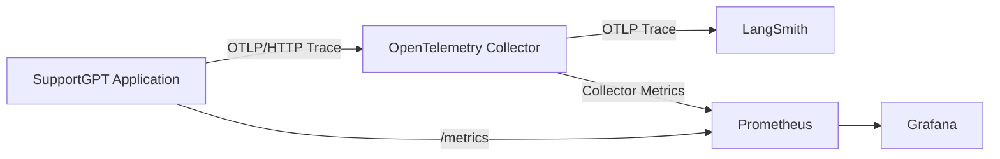

# OpenTelemetry Observability Phase 1

## 目标

本阶段在不改变 Agent 业务路由、Tool 权限和 HITL 规则的前提下，建立 LangSmith + OpenTelemetry + Prometheus/Grafana 可观测体系。



LangSmith 用于 Agent 语义级 Trace，OpenTelemetry 负责一次请求的通用分布式链路，Prometheus/Grafana 负责聚合指标、趋势与告警视图。

## Trace 范围

### Agent Trace

| 运行步骤 | OTel Span | LangSmith Run Type |
|---|---|---|
| LangGraph Workflow | `supportgpt.langgraph.workflow` | `chain` |
| Ticket Analyzer | `agent.analyzer` | workflow child |
| Retriever | `supportgpt.rag.hybrid_retriever` | `retriever` |
| Tool Calling | `supportgpt.tool.call` | `tool` |
| LLM Generation / QA | `supportgpt.llm.*` | `llm` |
| HITL | `approval.create_pending` / `approval.process` | OTel child span |

Agent Span 记录低基数关联字段：

- `request.id`
- `ticket.id`
- `agent.node`
- `kb.version`
- `tool.name`
- `operation.status`
- `operation.duration_seconds`

### 基础设施 Trace

启动时尝试自动接入：

- FastAPI server request
- SQLAlchemy engine
- Redis sync / async client
- HTTPX external client

Instrumentation 包未安装、重复初始化或 exporter 不可用时只记录 warning，不阻断服务启动和 Agent 业务执行。

### Trace ID 关联

HTTP middleware 接受或生成 `X-Request-ID`，并在响应头返回：

```text
X-Request-ID: <application request id>
X-Trace-ID: <32 character OpenTelemetry trace id>
```

`request.id` 通过 ContextVar 传入 Agent workflow 和子 Span，可与 `ticket.id` 一起定位单次客服请求。`customer_id`、`session_id` 和 `order_id` 不会以原文上报。

## 数据保护

上报前由 `src/observability/sanitization.py` 统一处理：

- email、电话、SSN、银行卡号文本脱敏。
- API key、Authorization、Cookie、Password、Token 过滤。
- 姓名、地址、支付明细、商品列表、金额和审批原文等业务字段过滤。
- URL query string 不进入 HTTP Span。
- Redis 只保留命令名和参数数量，不保留 key/value。
- Collector 再次删除 Authorization、Cookie、query、Redis args 和 GenAI 原文属性。

脱敏函数只创建 telemetry-safe 副本，不修改 Agent State 或业务数据。

## Prometheus Metrics

| 指标 | 含义 |
|---|---|
| `http_requests_total` | HTTP 请求量和状态 |
| `http_request_duration_seconds` | HTTP 耗时 Histogram |
| `agent_requests_total` | Agent workflow 成功/失败数 |
| `agent_node_executions_total` | Agent 节点执行数 |
| `agent_node_duration_seconds` | Agent 节点耗时 Histogram |
| `llm_tokens_total` | LLM input/output token |
| `agent_tool_calls_total` | Tool 各状态调用数 |
| `agent_tool_call_duration_seconds` | Tool 耗时 Histogram |
| `qa_score_ratio` | QA Score 分布 |
| `guardrail_violations_total` | 安全拦截次数 |
| `ticket_escalations_total` | Agent 推荐升级次数 |
| `human_approvals_total` | 实际人工审批事件 |

Tool 成功率查询示例：

```promql
sum by (tool_name) (rate(agent_tool_calls_total{status="success"}[5m]))
/
clamp_min(sum by (tool_name) (rate(agent_tool_calls_total[5m])), 0.000001)
```

Agent 节点 P95：

```promql
histogram_quantile(
  0.95,
  sum by (le, node) (rate(agent_node_duration_seconds_bucket[5m]))
)
```

## 配置

```dotenv
LANGSMITH_API_KEY=<your-key>
LANGSMITH_PROJECT=supportgpt-enterprise

OTEL_ENABLED=true
OTEL_SERVICE_NAME=supportgpt-backend
OTEL_EXPORTER_OTLP_TRACES_ENDPOINT=http://localhost:4318/v1/traces
OTEL_EXPORTER_OTLP_TIMEOUT_SECONDS=3
OTEL_TRACE_SAMPLE_RATIO=1.0
```

Docker Compose 默认将 Application Trace 发送到 Collector，Collector 再发送到 LangSmith OTLP endpoint。若同时启用 `LANGSMITH_TRACING=true`，还会开启旧版 LangSmith SDK 直连 Trace；Phase 1 推荐在 Compose 中保持其为 `false`，避免重复上报。

## 运行

```bash
docker compose -f deployment/docker-compose.yml up --build
```

组件地址：

- Backend metrics：`http://localhost:8000/metrics`
- Prometheus：`http://localhost:9090`
- Grafana：`http://localhost:3000`
- Grafana 默认账号：`admin` / `admin`（应通过 `GRAFANA_ADMIN_PASSWORD` 修改）
- OTLP gRPC：`localhost:4317`
- OTLP HTTP：`localhost:4318`

Grafana 启动后会自动加载 `SupportGPT Agent Observability` dashboard，包含 Agent 请求量、Agent/HTTP P95、Token、Tool 成功率、QA Score、Guardrail 和人工审批面板。

## 验收

1. 携带 `X-Request-ID` 调用 `/chat`。
2. 确认响应头包含 `X-Request-ID` 和 `X-Trace-ID`。
3. 在 LangSmith project 中按 `request.id` 或 `ticket.id` 检索 workflow，检查 Retriever、Tool 和 LLM 子 Run。
4. 在 Prometheus 查询 `agent_requests_total`、`agent_tool_calls_total` 和 `llm_tokens_total`。
5. 在 Grafana 检查九个预置面板。
6. 停止 Collector 后再发送客服请求，确认 Agent 仍正常返回业务结果。
